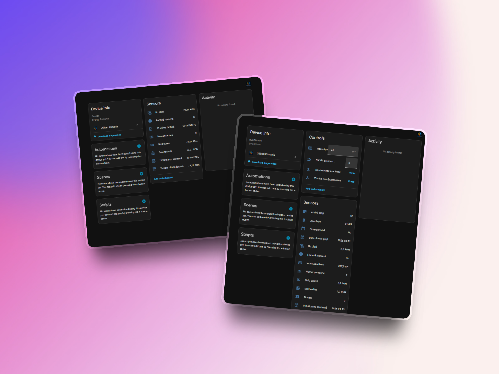

# Utilități România – Home Assistant Integration

Integrare unificată pentru gestionarea utilităților din România direct în Home Assistant.

Centralizează facturi, notificări și transmiterea indexului într-un singur loc, indiferent de furnizor.

---

## ✨ Funcționalități principale

- 📄 Facturi centralizate pentru mai mulți furnizori
- 🏠 Suport multi-locație (mai multe adrese / POD-uri / contracte)
- 🔔 Notificări automate:
  - facturi noi emise
  - deschiderea perioadei de citire a indexului
- ✍️ Transmitere index direct din dashboard
- 🧠 Detectare automată perioadă de citire
- 🔑 Sistem de licențiere integrat (trial 90 zile + lifetime)
- 🧩 Integrare nativă Home Assistant

---
## ✨ Funcționalități noi (v1.6.0)

- Marcarea manuală a facturilor ca plătite
- Status persistent (se păstrează după refresh și restart)
- Posibilitatea de a anula marcarea
- Interfață adaptivă (butonul dispare pentru facturile deja plătite)

### Marcarea manuală a facturilor

În situațiile în care plata este efectuată în altă aplicație (ex: bancă), iar furnizorul întârzie actualizarea statusului, poți marca manual factura ca plătită direct din cardul integrării.

Statusul este salvat local și se reflectă imediat în interfață.

## 🖼️ Interfață

### Card facturi utilități

---

### Integrarea în Home Assistant

---

### Device & Control

---

## ⚡ Furnizori suportați (în prezent)

- E.ON
- Hidroelectrica
- myElectrica
- Digi
- Nova
- Apă Canal Sibiu

👉 Lista este în continuă extindere. Vor fi adăugați și alți furnizori.

---

## 🚀 Instalare

### Prin HACS

1. Deschide HACS
2. Mergi la Integrations
3. Adaugă repository custom:
   https://github.com/mariusonitiu/utilitati_romania
4. Instalează integrarea
5. Restart Home Assistant

---

## ⚙️ Configurare

1. Settings → Devices & Services
2. Add Integration
3. Caută Utilități România

---

## 📊 Card custom

type: custom:utilitati-romania-facturi-card

🧩 Grupare facturi între furnizori

Integrarea permite acum gruparea manuală a facturilor provenite de la furnizori diferiți, astfel încât mai multe servicii (energie, gaz, internet etc.) aferente aceleiași locații să fie afișate împreună.

Cum funcționează:
Fiecare adresă / loc de consum poate avea o etichetă de grupare definită manual
Facturile cu aceeași etichetă sunt afișate împreună în card
Dacă nu este definită o etichetă, se folosește automat gruparea implicită
Configurare:
Accesează device-ul „Grupare facturi”
Completează câmpurile „Grupare facturi …” pentru fiecare locație
Folosește aceeași etichetă pentru locațiile care trebuie grupate

---

## 🔑 Licență

- Trial 90 zile inclus
- Upgrade la lifetime

---

## ☕ Susține proiectul

https://buymeacoffee.com/mariusonitiu

---

## 📌 Roadmap

- noi furnizori
- îmbunătățiri UI
- optimizări

---

## ⚠️ Disclaimer

Integrare neoficială.

## Atribuire și componente derivate

Această integrare este un proiect unificat și refactorizat pentru Home Assistant, dezvoltat pentru a grupa mai mulți furnizori de utilități din România într-o singură integrare.

Anumite componente, în special logica de comunicare API pentru unii furnizori, sunt derivate sau inspirate din proiecte open-source publicate de cnecrea sub licență MIT:

- https://github.com/cnecrea/eonromania
- https://github.com/cnecrea/hidroelectrica
- https://github.com/cnecrea/myelectrica

Codul derivat din aceste proiecte este utilizat cu respectarea licenței MIT, inclusiv păstrarea notificării de copyright originale.

Restul integrării, inclusiv structura unificată, agregarea facturilor, interfața de administrare, logica de licențiere, cardul Lovelace și adaptările specifice proiectului Utilități România, reprezintă contribuții proprii ale proiectului.
